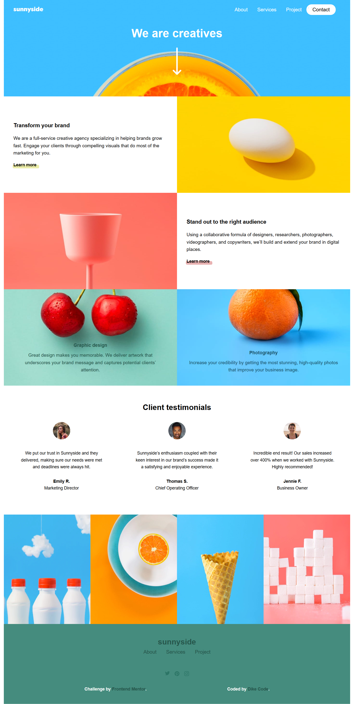
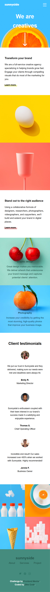
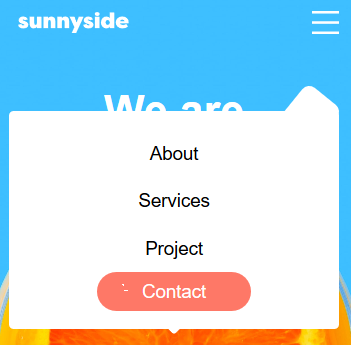

# Frontend Mentor - Sunnyside agency landing page solution

This is a solution to the [Sunnyside agency landing page challenge on Frontend Mentor](https://www.frontendmentor.io/challenges/sunnyside-agency-landing-page-7yVs3B6ef). Frontend Mentor challenges help you improve your coding skills by building realistic projects.

## Table of contents

- [Overview](#overview)
  - [The challenge](#the-challenge)
  - [Screenshot](#screenshot)
  - [Links](#links)
- [My process](#my-process)
  - [Built with](#built-with)
  - [What I learned](#what-i-learned)
  - [Continued development](#continued-development)
  - [Useful resources](#useful-resources)
- [Author](#author)
- [Acknowledgments](#acknowledgments)

A Sunny Agency Landing Page Solution from the Challange presented by Frontend Mentor... it's built with a pure HTML5 for laying out the structure, CSS for styling the website to make it more compelling, responsive and user friendly... A little bit of Javascript was also utilized in order to make the site more interactive.

### The challenge

Users should be able to:

-  View the optimal layout for the site depending on their device's screen size
-  See hover states for all interactive elements on the page

### Screenshot


 


### Links

-  Solution URL: [Solution](https://dike-code.github.io/Dike-Code/)
-  Live Site URL: [Live](https://dike-code.github.io/sunnyside-agency-landing-page/)

## My process

### Built with

-  Semantic HTML5 markup
-  CSS custom properties
-  Flexbox
-  CSS Grid
-  Desktop-first workflow
-  Javascript

### What I learned

I learnt all whole lot.

```html
  <!-- The Mobile navbar -->
```

```css
  .navigation.active {
      position: absolute;
      top: 100%;
      left: 0;
      width: 100%;
      height: 50vh;
      opacity: 1;
      z-index: 1;
      background: transparent;
      transition: 0.5s;
   }

   .navbar {
      position: relative;
      background: #fff;
      flex-direction: column;
      justify-content: center;
      align-items: center;
      width: 100%;
      height: auto;
      border-radius: 5px;
      padding: 20px;
   }
   .navbar::after {
      content: "";
      position: absolute;
      top: 0;
      right: 0;
      width: 100px;
      height: 50px;
      background: var(--White);
      transform: rotate(-51deg) translate(4%, 0%);
      z-index: -1;
      border-radius: 10px;
   }
```

```js
const proudOfThisFunc = () => {
   console.log("🎉");
};
```

### Continued development

All, Practice... Practice and Practice.

### Useful resources

-  [Traversy Media](https://www.youtube.com) - Traversy Media is a Youtube Channel pioneered by Brad Traversy it helped me with the full asimillation of CSS FLEX BOX and Grid. I really liked the pattern Brad uses in explaining all the concepts one needs to master a given craft.

-  [Youtube](https://www.youtube.com) - This is an amazing website/platform which helped me finally understand a lot including the snippets on buiding a dropdown list. I'd recommend it to anyone still learning this concept.

## Author

-  Frontend Mentor - [@Dike-Code](https://www.frontendmentor.io/profile/Dike-Code)

-  Linkedin - [Dike.O.Clinton](https://www.linkedin.com/in/dike-o-clinton-26b455220)

## Acknowledgments

With utmost gratitude I'd like to acknowledge:
Freecodecamp
Traversy Media
Dev.Ed
Jon Dukket Ebooks
Youtube.
